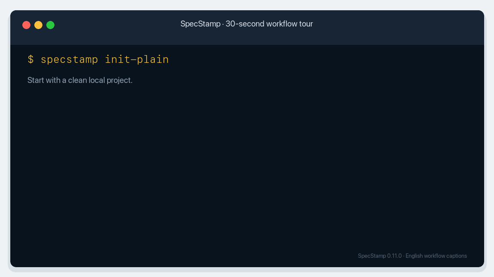

**English** · [简体中文](zh-CN/index.md)

# SpecStamp

## Give AI coding agents a workflow that survives the chat

SpecStamp keeps requirements, technical designs, tasks, changes, and acceptance evidence inside the local project, so Codex, Claude Code, and other coding agents can continue from the same structured facts.

[Get started in ten minutes](quick-start.md){ .md-button .md-button--primary }
[View on GitHub](https://github.com/muyuqingqiu/specstamp){ .md-button }

## Choose the right entry point

SpecStamp is the product name. The command you type depends on where you are working:

| Context | Use | Example |
| --- | --- | --- |
| Terminal | `specstamp ...` | `specstamp next` |
| Codex | `$sdlc-*` skill | `$sdlc-next` |
| Claude Code | `/sdlc-*` command | `/sdlc-next` |
| Existing CLI scripts | `codex-sdlc ...` compatibility entry point | `codex-sdlc next` |

These entry points run the same SpecStamp workflow. The `sdlc-*` names are retained for compatibility and do not identify a separate product. New terminal examples use `specstamp`; Codex examples use `$sdlc-*` so the two contexts are not mixed.

The tour uses concise English captions for the same verified 0.11.0 workflow, with each key screen held long enough to read.

## What it solves

| Common situation | Chat-only workflow | With SpecStamp |
| --- | --- | --- |
| A model or session changes | Context must be explained again | Resume from formal project state |
| Requirements change midway | Design, tasks, and acceptance drift apart | Apply an explicit, versioned change |
| An agent says work is complete | The claim is difficult to verify | Record commands, exit codes, files, and hashes |
| Source material is scattered | Requirements, code, and tests lose their links | Preserve references from source material to acceptance |

## Start here

- [Quick Start](quick-start.md): install SpecStamp, initialize a project, and inspect the first recommended step.
- [User Guide](user-guide.md): find commands by development scenario.
- [FAQ](faq.md): understand platform support, data locations, installation, and cleanup.
- [Philosophy and Inspiration](philosophy.md): learn why the workflow is local-first and evidence-based.
- [Quality and Security](quality-and-security.md): review CI, full test coverage, dependency updates, and security scanning.
- [中文文档](zh-CN/index.md): read the complete Simplified Chinese documentation.

## Project boundaries

SpecStamp is a Beta project supporting Python 3.10–3.13 on macOS, Linux, and other POSIX systems. Windows and cloud-based real-time collaboration are not currently supported.
