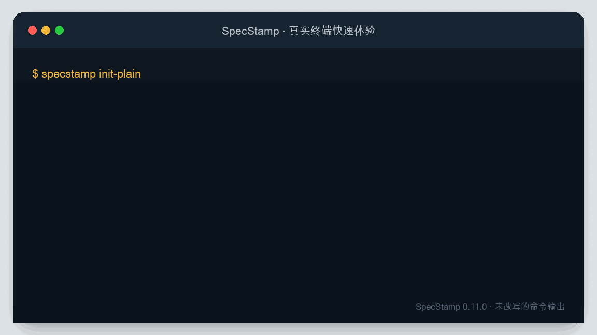

# SpecStamp

## 让 AI 编码不再只靠聊天记录

SpecStamp 把需求、技术设计、任务、变更和验收证据保存在项目本机，让 Codex、Claude Code 等 AI 编码 Agent 可以从同一份结构化事实继续工作。

[十分钟快速体验](快速开始.md){ .md-button .md-button--primary }
[查看 GitHub 仓库](https://github.com/muyuqingqiu/specstamp){ .md-button }

## 它解决什么问题

| 常见情况 | 只依赖聊天记录 | 使用 SpecStamp |
| --- | --- | --- |
| 换模型或重开会话 | 需要重新解释上下文 | 从项目里的正式状态继续 |
| 需求中途变化 | 设计、任务和验收容易不同步 | 通过显式变更生成新的生效版本 |
| Agent 声称完成 | 很难复核做过什么 | 登记命令、退出码、文件和证据哈希 |
| 资料散落 | 需求、代码和测试无法串联 | 原始资料到验收结果保留引用关系 |

## 从这里开始

- [快速开始](快速开始.md)：完成安装、初始化和首次状态检查。
- [使用指南](使用指南.md)：按日常开发场景查找命令。
- [最小可运行示例](https://github.com/muyuqingqiu/specstamp/tree/main/examples/%E6%9C%80%E5%B0%8F%E9%A1%B9%E7%9B%AE)：运行真实示例并查看生成结果。
- [常见问题](常见问题.md)：查看平台、数据位置、安装和清理边界。
- [质量与安全](质量与安全.md)：了解测试、覆盖率、依赖更新和安全扫描。

## 项目边界

SpecStamp 当前支持 Python 3.10～3.13，以及 macOS、Linux 等 POSIX 系统。项目处于 Beta 阶段，不支持 Windows，也不提供云端多人实时协作。
